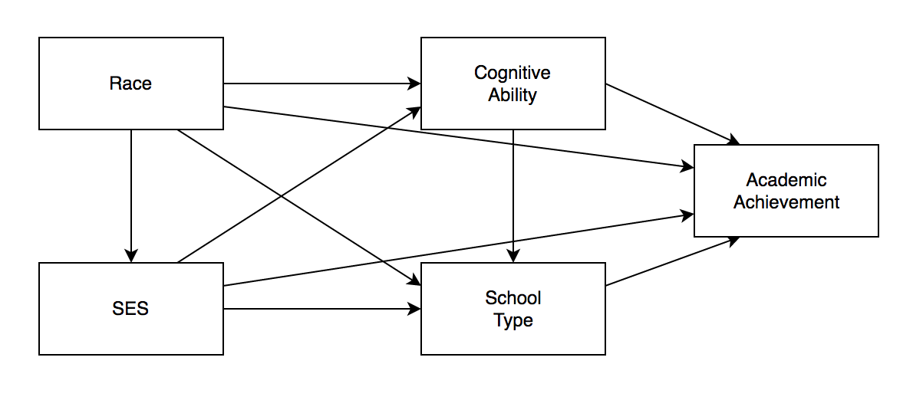
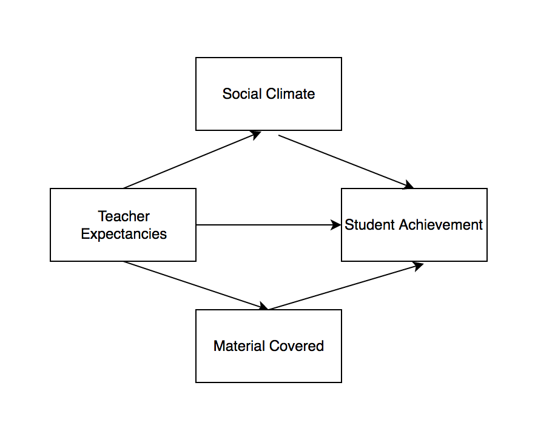

```{r setup, include=FALSE}
library(learnr)
library(learnSEM)
knitr::opts_chunk$set(echo = FALSE)
library(lavaan)
library(semPlot)

academic.cor <- lav_matrix_lower2full(c(1, 
                                        .178, 1, 
                                        .230, .327, 1, 
                                        .106, .245, .183, 1, 
                                        .195, .356, .721, .178, 1))
rownames(academic.cor) <- 
  colnames(academic.cor) <- 
  c("race", "ses", "cog", "school", "acad")

mediation.cov <- lav_matrix_lower2full(c(84.85, 
                                         71.28, 140.34, 
                                         18.83, -6.25, 72.92, 
                                         60.05, 84.54, 37.18, 139.48))
rownames(mediation.cov) <-
  colnames(mediation.cov) <- c("teacher", "social", "material", "achieve")
```

## Estimation, Path Models, and Fit Indices

This section of the course covers the beginning of `lavaan` syntax by introducing path models. You will first learn about estimation to get a broad sense of how these models can be analyzed. Next, you will learn how to write your own model code, analyze that model, and summarize the output. You will use `semPlot` to diagram your models, and we will end with fit indices and how to analyze and compare models. You should complete both path1 and path2 to cover this material. The learning outcomes are:

- Understand the different types of estimation and when they are used
- Distinguish between the different types of `lavaan` operators
- Build, analyze, summarize, and diagram a path model
- Distinguish the different types of fit indices 
- Determine how to compare two different structural equation models

## Path Analysis Videos

You can use `vignette("lecture_path", "learnSEM")` to view these notes in R.

<iframe width="560" height="315" src="https://www.youtube.com/embed/UAwelX7vK_w" frameborder="0" allow="accelerometer; autoplay; clipboard-write; encrypted-media; gyroscope; picture-in-picture" allowfullscreen></iframe>

## Exercises

In this next section, you will answer questions using the *R* code blocks provided. Be sure to use the `solution` option to see the answer if you need it!

Please enter your name for submission. If you do not need to submit, just type anything you'd like in this box. 

```{r details}
question_text(
  "Student Name:",
  answer("Your Name", correct = TRUE),
  incorrect = "Thanks!",
  try_again_button = "Modify your answer",
  allow_retry = TRUE
)
```

## Specify Your Model

Use the following picture as your guide to diagram your first path model. This model represents the relationship demographic variables (race, SES, school type), individual ability (cognitive ability) predicting academic achievement. 

```{r out.width="75%", results = 'asis'}

```

The data has been loaded for you as a correlation table. `lavaan` allows you to build models from raw data, covariance, or correlation matrices. Here's a visual of the data:

```{r}
academic.cor
```

Create the `lavaan` model code in the code box below using the variable names from the `academic.cor` data above, matched to the model picture shown above. You should call your model `academic.model`. 

```{r model1, exercise = TRUE}

```

```{r model1-solution}
academic.model <- ' 
acad ~ cog + race + ses + school
school ~ cog + race + ses
cog ~ race + ses
ses ~ race
'
```

## Analyze the Model

Analyze your path model using the `sem()` function, and name the model `academic.fit`. There are 18058 participants in the data for your `sample.nobs`. 

```{r analyze1-setup}
academic.model <- ' 
acad ~ cog + race + ses + school
school ~ cog + race + ses
cog ~ race + ses
ses ~ race
'
```

```{r analyze1, exercise = TRUE}

```

```{r analyze1-solution}
academic.fit <- sem(model = academic.model,
                    sample.cov = academic.cor,
                    sample.nobs = 18058)
```

## Summarize Your Model

Let's summarize the model you just created. Use the `summary()` function on your model with the standardized solution, rsquare values, and fit.measures all included. 

```{r summarize1-setup}
academic.model <- ' 
acad ~ cog + race + ses + school
school ~ cog + race + ses
cog ~ race + ses
ses ~ race
'
academic.fit <- sem(model = academic.model,
                    sample.cov = academic.cor,
                    sample.nobs = 18058)
```

```{r summarize1, exercise = TRUE}

```

```{r summarize1-solution}
summary(academic.fit,
        standardized = TRUE,
        rsquare = TRUE,
        fit.measures = TRUE)
```

## Create a Picture

Use `semPaths()` to create a picture of your path model. Use `par` for the `whatLabels` argument, any layout you would like, and `edge.label.cex = 1` to increase the font size. 

```{r diagram1-setup}
academic.model <- ' 
acad ~ cog + race + ses + school
school ~ cog + race + ses
cog ~ race + ses
ses ~ race
'
academic.fit <- sem(model = academic.model,
                    sample.cov = academic.cor,
                    sample.nobs = 18058)
```

```{r diagram1, exercise = TRUE}

```

```{r diagram1-solution}
semPaths(academic.fit, 
         whatLabels = "par", 
         layout = "spring",
         edge.label.cex = 1)
```

## Mediation Models

For this example, you will create a mediation model with two indirect effects. Use the following image to create your mediation model. Note that you will have two indirect effects: one representing the top half of the model and one representing the bottom half of the model. 

This model represents the mediating effects of social climate and the material covered in class on the relationship between teacher expectations and student achievement. The model predicts that teacher expectations actually predict social climate and materials, which then lead to student achievement levels if a mediating effect is found. 

```{r out.width="75%", results = 'asis'}

```

```{r}
mediation.cov
```

Using the names from the mediation covariance table, and the model diagram above, create `mediation.model` syntax for this path model. 

```{r build2, exercise = TRUE}

```

```{r build2-solution}
mediation.model <- '
achieve ~ b1*social + b2*material + c*teacher
material ~ a2*teacher
social ~ a1*teacher
indirect:= a1*b1
indirect2:=a2*b2
'
```

## Analyze the Model

Analyze your path model using the `sem()` function. There are 40 participants for the `sample.nobs` argument. Save your model as `mediation.fit`.

```{r analyze2-setup}
mediation.model <- '
achieve ~ b1*social + b2*material + c*teacher
material ~ a2*teacher
social ~ a1*teacher
indirect:= a1*b1
indirect2:=a2*b2
'
```

```{r analyze2, exercise = TRUE}

```

```{r analyze2-solution}
mediation.fit <- sem(model = mediation.model,
                     sample.cov = mediation.cov,
                     sample.nobs = 40)
```

## Summarize Your Model

Use the `summary()` function to summarize your model using the standardized solution, including fit.measures and rsquare as options. 

```{r summary2-setup}
mediation.model <- '
achieve ~ b1*social + b2*material + c*teacher
material ~ a2*teacher
social ~ a1*teacher
indirect:= a1*b1
indirect2:=a2*b2
'
mediation.fit <- sem(model = mediation.model,
                     sample.cov = mediation.cov,
                     sample.nobs = 40)
```

```{r summary2, exercise = TRUE}

```

```{r summary2-solution}
summary(mediation.fit,
        standardized = TRUE,
        fit.measures = TRUE,
        rsquare = TRUE)
```

## Create a Picture

Use `semPaths()` to create a picture of your path model. Use `par` for the `whatLabels` argument, any layout you would like, and `edge.label.cex = 1` to increase the font size.  

```{r diagram2-setup}
mediation.model <- '
achieve ~ b1*social + b2*material + c*teacher
material ~ a2*teacher
social ~ a1*teacher
indirect:= a1*b1
indirect2:=a2*b2
'
mediation.fit <- sem(model = mediation.model,
                     sample.cov = mediation.cov,
                     sample.nobs = 40)
```

```{r diagram2, exercise = TRUE}

```

```{r diagram2-solution}
semPaths(mediation.fit, 
         whatLabels = "par", 
         layout = "spring",
         edge.label.cex = 1)
```

## Submit

On this page, you will create the submission for your instructor (if necessary). Please copy this report and submit using a Word document or paste into the text window of your submission page. Click "Generate Submission" to get your work! 

```{r context="server"}
encoder_logic()
```

```{r encode, echo=FALSE}
encoder_ui()
```
