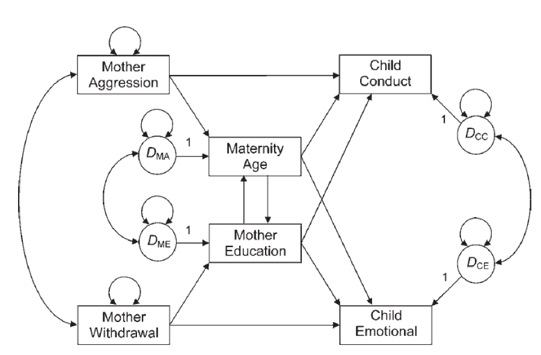

```{r setup, include=FALSE}
library(learnr)
library(learnSEM)
knitr::opts_chunk$set(echo = FALSE)
library(lavaan)
library(semPlot)

mother.cor <- lav_matrix_lower2full(c(1, 
                                    .19, 1, 
                                    -.16, -.20, 1, 
                                    -.37, -.06, .36, 1, 
                                    -.06, -.05, -.03, -.25, 1, 
                                    .13, -.06, -.09, -.28, .41, 1))
rownames(mother.cor) <- 
  colnames(mother.cor) <- 
  c("agg", "with", "edu", "age", "emotion", "conduct")
```

## Estimation, Path Models, and Fit Indices

This section of the course covers the beginning of `lavaan` syntax by introducing path models. You will first learn about estimation to get a broad sense of how these models can be analyzed. Next, you will learn how to write your own model code, analyze that model, and summarize the output. You will use `semPlot` to diagram your models, and we will end with fit indices and how to analyze and compare models. You should complete both path1 and path2 to cover this material. The learning outcomes are:

- Understand the different types of estimation and when they are used
- Distinguish between the different types of `lavaan` operators
- Build, analyze, summarize, and diagram a path model
- Distinguish the different types of fit indices 
- Determine how to compare two different structural equation models

## Path Analysis Videos

You can use `vignette("lecture_path", "learnSEM")` to view these notes in R. 

<iframe width="560" height="315" src="https://www.youtube.com/embed/s0Vep97wWak" frameborder="0" allow="accelerometer; autoplay; clipboard-write; encrypted-media; gyroscope; picture-in-picture" allowfullscreen></iframe>

## Exercises

In this next section, you will answer questions using the *R* code blocks provided. Be sure to use the `solution` option to see the answer if you need it!

Please enter your name for submission. If you do not need to submit, just type anything you'd like in this box. 

```{r details}
question_text(
  "Student Name:",
  answer("Your Name", correct = TRUE),
  incorrect = "Thanks!",
  try_again_button = "Modify your answer",
  allow_retry = TRUE
)
```

## Specify Your Model

Use the following picture as your guide for building the path model. You can download this image online from Canvas. Be sure to save it in the same folder as your markdown file. 

This model represents the relationship between maternal variables (aggression, age, education, and withdrawal) and child outcomes (conduct and emotional ability). The model predicts that child conduct and emotional capabilities are determined by interaction with the mother based on her demographics (age, education) and behavior (aggression, withdrawal). Note that the model includes a depiction of the residuals (the circles with the *D*), which you do not have to manually add in `lavaan`. However, you should correlate `~~` the residuals between the noted variables.

```{r out.width="75%", results = 'asis'}

```

The data has been loaded for you as a correlation table. Here's a visual of the data:

```{r}
mother.cor
```

Create the `lavaan` model code in the code box below using the variable names from the `mother.cor` data above, matched to the model picture shown above. You should call your model `mother.model`. Remember that you can use `~~` to correlate the error terms shown in the model. 

```{r model1, exercise = TRUE}

```

```{r model1-solution}
mother.model <- '
conduct ~ agg + age + edu
emotion ~ age + edu + with
edu ~ with
age ~ agg
age ~~ edu
emotion ~~ conduct
'
```

## Analyze the Model

Analyze your path model using the `sem()` function, and name the model `mother.fit`. There are 200 participants in the data for your `sample.nobs`. 

```{r analyze1-setup}
mother.model <- '
conduct ~ agg + age + edu
emotion ~ age + edu + with
edu ~ with
age ~ agg
age ~~ edu
emotion ~~ conduct
'
```

```{r analyze1, exercise = TRUE}

```

```{r analyze1-solution}
mother.fit <- sem(model = mother.model,
                    sample.cov = mother.cor,
                    sample.nobs = 200)
```

## Summarize Your Model

Let's summarize the model you just created. Use the `summary()` function on your model with the standardized solution, rsquare values, and fit.measures all included. 

```{r summarize1-setup}
mother.model <- '
conduct ~ agg + age + edu
emotion ~ age + edu + with
edu ~ with
age ~ agg
age ~~ edu
emotion ~~ conduct
'
mother.fit <- sem(model = mother.model,
                    sample.cov = mother.cor,
                    sample.nobs = 200)
```

```{r summarize1, exercise = TRUE}

```

```{r summarize1-solution}
summary(mother.fit,
        standardized = TRUE,
        rsquare = TRUE,
        fit.measures = TRUE)
```

## Create a Picture

Use `semPaths()` to create a picture of your path model. Use `par` for the `whatLabels` argument, any layout you would like, and `edge.label.cex = 1` to increase the font size. 

```{r diagram1-setup}
mother.model <- '
conduct ~ agg + age + edu
emotion ~ age + edu + with
edu ~ with
age ~ agg
age ~~ edu
emotion ~~ conduct
'
mother.fit <- sem(model = mother.model,
                    sample.cov = mother.cor,
                    sample.nobs = 200)
```

```{r diagram1, exercise = TRUE}

```

```{r diagram1-solution}
semPaths(mother.fit, 
         whatLabels = "par", 
         layout = "spring",
         edge.label.cex = 1)
```

## Model Comparison

In a second model, you can either remove the environmental component (withdrawal and aggression) or the genetic component (age, education used as a proxy for IQ). Specify that model below by creating `mother.model2`. 

```{r build2, exercise = TRUE}

```

```{r build2-solution}
mother.model2 <- ' #use this one
conduct ~ age + edu
emotion ~ age + edu 
conduct ~~ emotion'
mother.model2 <- ' #or this one
conduct ~ agg 
emotion ~ with'
```

## Analyze the Model

Analyze your path model using the `sem()` function as you did in the previous exercise with 200 participants. Call this model `mother.fit2`.

```{r analyze2-setup}
mother.model2 <- '
conduct ~ age + edu
emotion ~ age + edu 
conduct ~~ emotion
'
##or

mother.model2 <- '
conduct ~ agg 
emotion ~ with
'
```

```{r analyze2, exercise = TRUE}

```

```{r analyze2-solution}
mother.fit2 <- sem(model = mother.model2,
                    sample.cov = mother.cor,
                    sample.nobs = 200)
```

## Summarize Your Model

Use the `summary()` function to summarize your model using the standardized solution, including fit.measures and rsquare as options. 

```{r summary2-setup}
mother.model2 <- '
conduct ~ age + edu
emotion ~ age + edu 
conduct ~~ emotion
'
##or

mother.model2 <- '
conduct ~ agg 
emotion ~ with
'

mother.fit2 <- sem(model = mother.model2,
                    sample.cov = mother.cor,
                    sample.nobs = 200)
```

```{r summary2, exercise = TRUE}

```

```{r summary2-solution}
summary(mother.fit2,
        standardized = TRUE,
        fit.measures = TRUE,
        rsquare = TRUE)
```

## Create a Picture

Use `semPaths()` to create a picture of your path model. Use `par` for the `whatLabels` argument, any layout you would like, and `edge.label.cex = 1` to increase the font size.  

```{r diagram2-setup}
mother.model2 <- '
conduct ~ age + edu
emotion ~ age + edu 
conduct ~~ emotion
'
##or

mother.model2 <- '
conduct ~ agg 
emotion ~ with
'

mother.fit2 <- sem(model = mother.model2,
                    sample.cov = mother.cor,
                    sample.nobs = 200)
```

```{r diagram2, exercise = TRUE}

```

```{r diagram2-solution}
semPaths(mother.fit2, 
         whatLabels = "par", 
         layout = "spring",
         edge.label.cex = 1)
```

## Fit Comparison

Use the `anova()` function to compare the models directly using the chi-square difference test. Include the `fitmeasures()` of `aic` and `ecvi` to show the non-nested model comparison. 

```{r compare-setup}
mother.model <- '
conduct ~ agg + age + edu
emotion ~ age + edu + with
edu ~ with
age ~ agg
age ~~ edu
emotion ~~ conduct
'
mother.fit <- sem(model = mother.model,
                    sample.cov = mother.cor,
                    sample.nobs = 200)

mother.model2 <- '
conduct ~ age + edu
emotion ~ age + edu 
conduct ~~ emotion
'
##or

mother.model2 <- '
conduct ~ agg 
emotion ~ with
'

mother.fit2 <- sem(model = mother.model2,
                    sample.cov = mother.cor,
                    sample.nobs = 200)
```

```{r compare, exercise = TRUE}

```

```{r compare-solution}
anova(mother.fit, mother.fit2)
fitmeasures(mother.fit, c("aic", "ecvi"))
fitmeasures(mother.fit2, c("aic", "ecvi"))
```

```{r bettermodel-open}
question_text(
  "Which model is better? ",
  answer("The second model", correct = TRUE),
  incorrect = "You should find the model with the lower AIC and ECVI.",
  try_again_button = "Modify your answer",
  allow_retry = TRUE
)
```

```{r interpretation-open}
question_text(
  "Interpret one of the loadings for your best model. What does it imply? Is it significant? Click on Summarize Your Model to view the loadings.",
  answer("Interpret a loading.", correct = TRUE),
  incorrect = "Here's an example: mother aggression positively predicts conduct, as aggression increases, so does conduct behaviors. This path was significant.",
  try_again_button = "Modify your answer",
  allow_retry = TRUE
)
```

## Submit

On this page, you will create the submission for your instructor (if necessary). Please copy this report and submit using a Word document or paste into the text window of your submission page. Click "Generate Submission" to get your work! 

```{r context="server"}
encoder_logic()
```

```{r encode, echo=FALSE}
encoder_ui()
```
